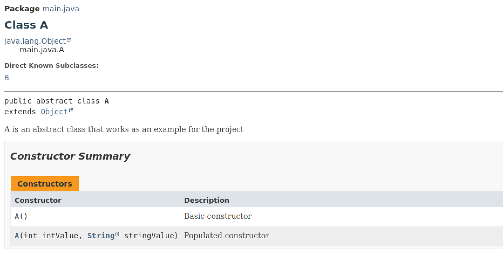

### Automated Javadocs ☕📝

> Every push on main triggers the action and [deploys javadocs](https://tonycituk.github.io/automated-javadoc/), it looks like this ⬇️⬇️.

This repo makes use of github actions to create javadocs from the java files at [src/main/java](./src/main/java/).

You can view the defined workflow [right here!](./.github/workflows/main.yml)
- Just get a JDK
- Run Javadoc instructions
- Deploy! 🚀 

Check out other automation workflows i've designed at [skew-dev/cinephilia](https://github.com/skew-dev/cinephilia/tree/main/.github/workflows).